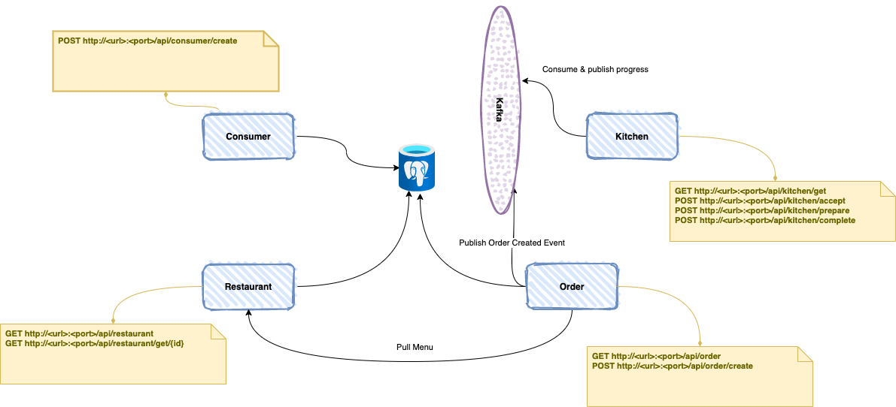

# Getting started

Foodie is a simple food provider that allow user to perform online booking and track the progress of the order. The services consist of 
- Consumer Service
- Restaurant Service
- Order Service 
- Kitchen Service

## Tech stack 

Foodie consist of 
- SDK Java 11
- Springboot as main bootstrap  
- Maven as building tools 
- Postgres and Kafka as persistance  layer 


## Diagrams 



## Build instructions

```bash
make help
	tasks:
		help                           List available tasks on this project
		build.builder                  Create builder image with maven cache 
		build.consumer                 Compile and create consumer image  
		build.restaurant               Compile and create restaurant image  
		build.order                    Compile and create order image  
		build.kitchen                  Compile and create kitchen image  
		build.all                      Compile and create all images image  
		delete.builder                 Remove builder image
		delete.consumer                Delete consumer image  
		delete.restaurant              Delete restaurant image  
		delete.order                   Delete order image  
		delete.kitchen                 Delete kitchen image  
		delete.all                     Delete all images  
		compose.up                     Start microservices
		compose.down                   Stop microservices
```


## Deployment 

**Foodie** is running on docker and docker-compose and the food service provider wish to re-platform their application to a more scalable solutions such as kubernetes. Your task is to work on migration strategies and produce kubernetes object.


### Scenario 1
Migrate the following 
- Database
- Consumer Service
- Restaurant Service


### Scenario 2
Migrate the following 
- Kafka
- Order Service
- Kitchen Service


### Scenario 3
Integrate with the following
- Prometheus 
- logging with kibana


### Bonus Points
Implementing the followings
- Pod QOS
- Disruption Budget
- ConfigMap


### Coming Soon
- Service Mesh
- Logging - WIP
- Monitoring - WIP
